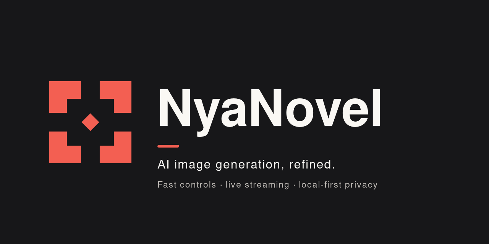

<p align="center">
  
</p>

<p align="center">
  A fast, local-first studio for NovelAI image generation.<br />
  More control, clearer feedback, and less friction between an idea and its next iteration.
</p>

<p align="center">
  <a href="#quick-start">Quick start</a> ·
  <a href="#features">Features</a> ·
  <a href="#docker">Docker</a> ·
  <a href="#privacy-and-data">Privacy</a> ·
  <a href="#development">Development</a>
</p>

## About NyaNovel

NyaNovel is an unofficial browser client for NovelAI image generation. It keeps the depth of
NovelAI's generation controls while presenting them as a focused, responsive creative workspace:
compose on the left, review in the center, and move through local history on the right.

Generation requests are made from the browser through
[`nekoai-js`](https://github.com/Nya-Foundation/NekoAI-JS). NyaNovel does not require its own account
server or image database. Your connection settings stay in browser storage, and generated images are
kept locally in IndexedDB.

NyaNovel is part of the **latent.moe** family and is maintained by the
[Nya Foundation](https://github.com/Nya-Foundation).

## Features

### Generation studio

- NovelAI Diffusion V4.5 Full and Curated, V4 Full and Curated, Anime V3, and Furry V3.
- Portrait, landscape, square, and wallpaper presets with custom width and height controls.
- Steps, sampler, prompt guidance, CFG rescale, noise schedule, batch size, and seed controls.
- Quality tags, undesired-content presets, dynamic thresholding, and automatic SMEA.
- Random or pinned seeds with per-result seed restoration.
- Complete generation settings saved with every image.

### Live generation feedback

- Streamed intermediate frames that resolve in place while NovelAI generates.
- Per-sample step progress, aggregate batch progress, and elapsed time.
- Multi-image streaming grids that preserve the requested aspect ratio.
- Stop control for in-flight batches; completed samples are preserved when possible.
- Actionable connection, quota, network, and generation error states.

### Characters and references

- V4 and V4.5 multi-character prompts.
- Per-character prompt, undesired content, enabled state, and visual position control.
- Multiple vibe-transfer references with individual strength and information-extracted values.
- Multiple Director references with independent controls.
- Image previews and removable reference cards directly inside the composer.

### Director tools

Apply NovelAI Director operations to any selected result:

- Line art
- Sketch
- Background removal
- Declutter
- Colorize
- Change emotion
- 4× upscale
- Enhance

Director outputs return to the same local gallery and retain the source image's generation metadata.

### Prompting and iteration

- Inline NovelAI tag suggestions with category styling and post counts.
- Suggestions inside main, undesired-content, and character prompt fields.
- One-click seed reuse or complete settings restoration from any result.
- Drag-and-drop NovelAI PNG recipe import, including V4 character prompts and positions.
- Undo support when settings are replaced or an image is deleted.
- Example prompts that append safely to work already in progress.

### Local gallery and review

- IndexedDB-backed image history grouped by generation batch.
- Selecting a gallery result automatically loads its saved generation recipe into the composer.
- Batch filmstrip with mouse and keyboard navigation.
- Focused lightbox with zoom and previous/next navigation.
- Download, clipboard copy, copy seed, reuse settings, and delete actions.
- Local-storage error recovery and explicit clear-all confirmation.

### Interface

- Persistent three-panel workstation on wide displays.
- Animated composer and gallery drawers on compact displays.
- Dark and light themes with Signal Coral branding and optional accent palettes.
- Reduced-motion support, visible focus states, focus-trapped dialogs, and accessible status updates.
- Responsive result metadata and controls designed for both pointer and touch input.

## Quick start

### Requirements

- A recent [Bun](https://bun.sh/) release.
- A modern browser with IndexedDB support.
- A NovelAI account with image-generation access and a persistent API token.

### Install and run

```bash
git clone https://github.com/Nya-Foundation/NyaNovel.git
cd NyaNovel
bun install --frozen-lockfile
bun run dev
```

Open [http://localhost:3000](http://localhost:3000).

On first launch, enter your NovelAI persistent API token. You can create one under NovelAI's
**Account → Get Persistent API Token** settings. The default API host is
`https://image.novelai.net`.

> Image generation consumes your NovelAI account's available Anlas according to NovelAI's current
> pricing and account rules.

## Keyboard shortcuts

| Shortcut | Action |
| --- | --- |
| <kbd>⌘</kbd>/<kbd>Ctrl</kbd> + <kbd>Enter</kbd> | Generate from anywhere in the studio |
| <kbd>[</kbd> | Toggle the composer |
| <kbd>]</kbd> | Toggle the gallery |
| <kbd>Esc</kbd> | Close the active dialog, lightbox, or compact drawer |
| <kbd>←</kbd> / <kbd>→</kbd> | Move through batch results or lightbox images |
| <kbd>+</kbd> / <kbd>−</kbd> | Zoom in or out in the lightbox |
| <kbd>0</kbd> | Reset lightbox zoom |

Tag suggestions support arrow-key navigation and can be accepted with <kbd>Enter</kbd> or
<kbd>Tab</kbd>.

## Production build

Create and run the Next.js production build:

```bash
bun run build
bun run start
```

The server listens on port `3000` by default.

Social metadata is origin-aware at runtime. NyaNovel uses `Host`, `X-Forwarded-Host`, and
`X-Forwarded-Proto` to produce absolute Open Graph and Twitter image URLs, so the same build can run
on different domains without modification.

If you want to force a canonical public origin, set the optional server-side `SITE_URL` variable
when starting the application—no rebuild is required:

```bash
SITE_URL=https://nyanovel.example.com bun run start
```

## Docker

The included multi-stage image uses Bun only during installation and compilation. The runtime image
contains a minimal Alpine base, the official Node 22 binary, and Next.js standalone output. It runs
as an unprivileged user and includes a dependency-free health check.

### Docker Compose

```bash
docker compose up --build
```

Open [http://localhost:8080](http://localhost:8080).

Behind a correctly configured reverse proxy, no origin configuration is required. You can optionally
force a canonical origin at runtime:

```bash
SITE_URL=https://nyanovel.example.com docker compose up -d --build
```

### Docker CLI

```bash
docker build -t nyanovel .

docker run --rm -p 8080:3000 nyanovel
```

Optional canonical-origin override:

```bash
docker run --rm -p 8080:3000 \
  -e SITE_URL=https://nyanovel.example.com \
  nyanovel
```

## Privacy and data

NyaNovel is local-first, but it is important to understand where each kind of data goes.

| Data | Storage or destination |
| --- | --- |
| API token and connection preferences | Browser local storage for the current origin |
| Prompts, settings, and reference images used for generation | Sent to the configured image API host |
| Generated images and per-image settings | Browser IndexedDB for the current origin |
| Theme and panel preferences | Browser local storage |

With the default configuration, generation traffic goes directly from your browser to NovelAI. If
you configure a different Host URL, your token or access key, prompts, references, and generation
requests are sent to that host instead.

NyaNovel does not upload your local gallery to an application server. Clearing site data, using a
different browser profile, or changing the deployment origin can make locally stored settings and
images unavailable. Download important results you want to retain independently.

Treat any deployed NyaNovel origin as trusted: browser local storage is accessible to JavaScript
served by that same origin.

## Architecture

NyaNovel is a Next.js App Router application. The server delivers the application shell; sensitive
generation and storage operations happen in the browser.

| Path | Responsibility |
| --- | --- |
| `app/` | Application entry point, metadata, fonts, and global design tokens |
| `components/sidebar/` | Generation settings, prompting, characters, and reference controls |
| `components/canvas/` | Streaming previews, result stage, lightbox, and Director tools |
| `components/gallery/` | Local batch history and gallery actions |
| `components/ui/` | Shared accessible interface primitives |
| `lib/nai/` | Connection persistence, SDK adapter, settings mapping, and model options |
| `lib/db/` | IndexedDB gallery persistence |
| `lib/store.ts` | Zustand application state and generation lifecycle |
| `assets/brand/` | Latent Frame logos, mark, app icon, and social artwork |

### Technology

- [Next.js](https://nextjs.org/) 16 and React 19
- [Tailwind CSS](https://tailwindcss.com/) v4
- [Zustand](https://zustand.docs.pmnd.rs/) for client state
- [`nekoai-js`](https://github.com/Nya-Foundation/NekoAI-JS) for NovelAI operations
- IndexedDB for local image persistence
- Bun for dependency management and builds
- TypeScript throughout

## Development

### Commands

| Command | Description |
| --- | --- |
| `bun run dev` | Start the development server |
| `bun run build` | Create the optimized standalone production build |
| `bun run start` | Run the production Next.js server |
| `bun run lint` | Run ESLint |
| `bun run typecheck` | Run TypeScript without emitting files |

Before opening a pull request, run:

```bash
bun run typecheck
bun run lint
bun run build
```

### Contributing

Issues and focused pull requests are welcome. Keep changes scoped, preserve local-first behavior, and
include proportional verification for generation lifecycle, persistence, accessibility, or responsive
layout changes.

Do not commit API tokens, generated `.env` files, or private reference images.

## Troubleshooting

### The token is rejected

Create a fresh persistent token in NovelAI account settings and copy the complete value. If you use a
custom host, verify both the host URL and the credential expected by that host.

### My gallery is empty

The gallery belongs to the exact browser profile and site origin where the images were generated.
Check that site storage was not cleared and that you are using the same protocol, hostname, and port.

### Shared links use the wrong host or protocol in their preview metadata

Configure your reverse proxy to pass `Host` or `X-Forwarded-Host` and `X-Forwarded-Proto`. If that is
not possible, set `SITE_URL` to the canonical public origin and restart the container. Rebuilding the
image is not required.

### Generation cannot reach a custom host

Because requests originate in the browser, the custom host must accept requests from the NyaNovel
deployment origin and expose the API behavior expected by `nekoai-js`.

## Legal

NyaNovel is an independent, unofficial project and is not affiliated with or endorsed by NovelAI or
Anlatan. You are responsible for complying with NovelAI's terms, the rules of any configured API
host, and all applicable laws. The software is provided without warranty.

## License

NyaNovel is released under the [MIT License](LICENSE). Copyright © 2025 Nya Foundation.

Third-party packages remain subject to their own licenses. In particular, `nekoai-js` is distributed
under the AGPL-3.0 license; see its upstream repository for details.

---

<p align="center">
  Made with care by the Nya Foundation.
</p>
